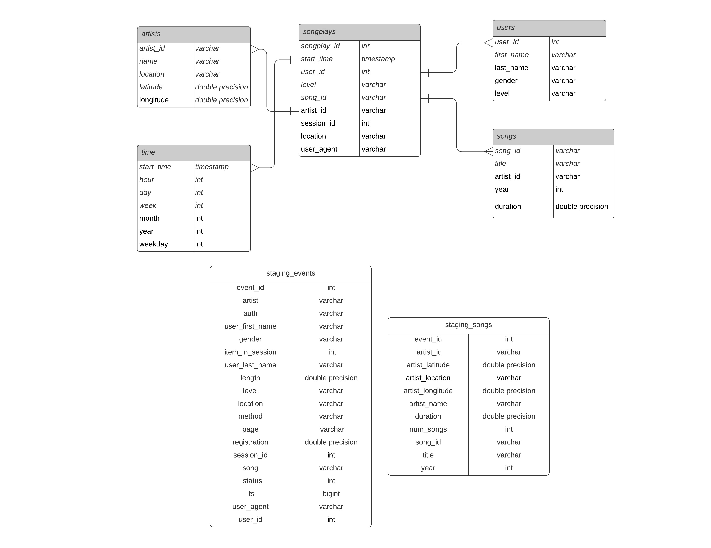

# Summary of the project
A music streaming startup Sparkify, has grown their user base and song database and want to move them onto the cloud. This project uses AWS to build an ETL pipeline that extracts their data from S3, stages them in Redshift, and transforms data into a set of dimensional tables.

# Database Schema

# How to run Python scripts
- Open terminal and run: python create_tables.py
- then run: python etl.py

# Preparation
 - Create IAM role, redshift cluster using the AWS python SDK (IaC.ipynb and  dwh_1.cfg)
 - Use information available to fill out dwh.cfg

# Explanation of the files
- create_tables.py is used to drop tables and create tables using the queries imported from sql_queries.py
- sql_queries.py contains sql queries to create\drop tables(staging_events, staging_songs, fact table(songplays), dimension tables(users,songs,artists,time), and insert data into these tables.
- etl.py loads data from S3 into staging tables on Redshift and then processes that data into your fact and dimension tables.
- dwh.cfg contains info about the cluster, IAM role and s3 links.

# Reference
- Load from JSON data: https://docs.aws.amazon.com/redshift/latest/dg/r_COPY_command_examples.html#copy-from-json-examples-using-jsonpaths
- Convert ts to timestamp in redshift: https://knowledge.udacity.com/questions/154533
- Problem when loading data in tables: https://knowledge.udacity.com/questions/233374
- Data type for ts in staging_events table: https://knowledge.udacity.com/questions/146646
- Takes a long time to load staging_song table: https://knowledge.udacity.com/questions/358793